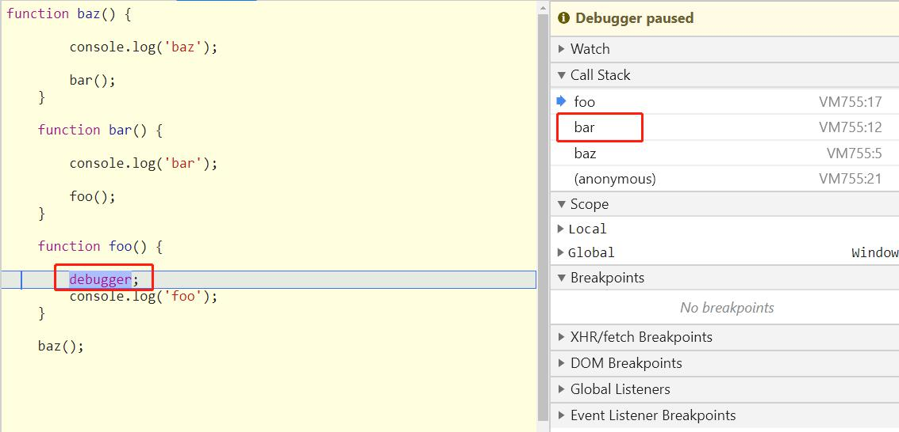

## 调用位置

在第一章中，我们排除了一些对于 this 的错误理解并且明白了 **每个函数的this是在调用时被绑定的，完全取决于函数的调用位置（也就是函数的调用方法）**

------------------------------------------------

### 1. 调用位置

在理解 this 的绑定过程之前，首先要理解 **调用位置**：调用位置就是 **函数在代码中被调用的位置（而不是声明的位置）**。只有仔细分析调用位置才能回答这个问题：这个 this 到底引用的是什么？

通常来说，寻找调用位置就是寻找“函数被调用的位置”，但是做起来并没有这么简单，因为某些编程模式可能会隐藏真正的调用位置。

最重要的是要分析 **调用栈**（就是为了到达当前执行位置所调用的所有函数）。我们关心的 **调用位置**就在当前正在执行的函数的 **前**一个调用 **中**。

下面我们来看看到底什么是调用栈和调用位置：

```
	function baz() {
		
		// 当前调用栈是: baz
		// 因此，当前调用位置是全局作用域
		
		console.log('baz');
		
		bar(); // <-- bar()的调用位置
	}
	
	function bar() {
		
		// 当前调用栈是： baz --> bar
		// 因此，当前调用位置在 baz中
		
		console.log('bar');
		
		foo(); // <-- foo()的调用位置
	}
	
	function foo() {
		
		// 当前调用栈是： baz --> bar --> foo
		// 因此，当前调用位置在 bar 中
		
		console.log('foo');
	}
	
	baz(); // <-- baz()的调用位置
```

注意我们是如何（从调用栈中）分析出真正的调用位置的，因为它决定了 this 的绑定。

**调用栈**： 你可以把调用栈想象成一个函数调用链，就像我们在前面代码段的注释中所写的一样。但是这种方法非常麻烦并且容易出错。另一个查看调用栈的方法是使用浏览器的调试工具。绝大多数现代浏览器都内置了开发者工具，其中包括JavaScript调试器。就本例来说，你可以在工具中给 foo()函数的第一行代码设置一个断点，或者直接在第一行代码之前插入一条 debugger;语句。运行代码时，调试器会在那个位置暂停，同时会展示当前位置的函数调用列表，这就是你的调用栈。因此，如果你想要分析 this 的绑定，使用开发者工具得到调用栈，然后找到栈中第二个元素，这就是真正的调用位置。




